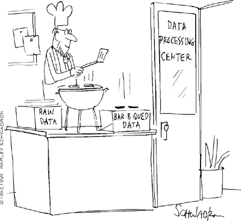

#Week 3: Working with Data#
### Objectives ###

The lessons this week will focus on learning about data visualizations and data formats. First, you will learn how visualization masters enable others to _see_ data. Next, you will start using an iPython notebook to make data visualizations. In particular, you will learn how to make general plots, and how to create and interpret scatter plots by using the Matplotlib and Seaborn libraries. Finally, we will discuss the text data format, which will include the .csv and .txt files as well as JSON files, before concluding with a discussion on how to read and write XML documents.

#####By the end of this lesson, you should be able to:######

- Understand the power of strong visualizations
- Understand how to use Matplotlib and the Seaborn libraries within an iPython notebook to create a new plot
- Understand how to make scatter plots in Python in order to understand a data set
- Understand how to read and write a CSV file.
- Understand how to read and write a JSON file.
- Understand how to read and write and XML formatted file.

### Activities and Assignments ###

|Activities and Assignments | Time Estimate | Deadline* | Points|
|:------| -----|-------|----------:|
|**[Week 3 Lesson 1: Introduction to Data Visualizations](lesson1.md)**| 2 Hours |Thursday| 20|
|**[Week 3 Lesson 2: Introduction to Data Formats](lesson2.md)**| 2 Hours | Thursday | 20 |

*Please note that unless otherwise noted, the due time is 6pm Central time!

----------

Photo Credit: Data Processing Center.  By Harley Schwadron. From cartoonstock.com.  Accessed 3 August 2015.

